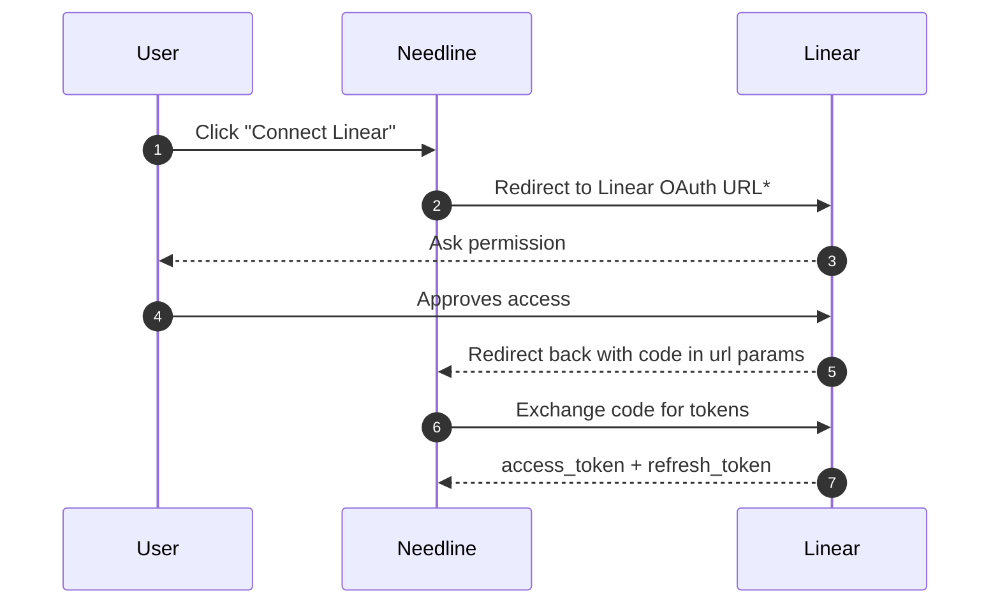

# Linear auth
> No linear SDK is used, since it does not return serialisable objects, using GraphQL client is more convenient.
## Process
Using OAuth to have `app=actor`

`*` - url is constructed in `src/lib/utils/linearAuthUrl.ts`

## Token Refreshing
This is done in `src/lib/server/linear/auth.ts`. Following Linear Docs.
