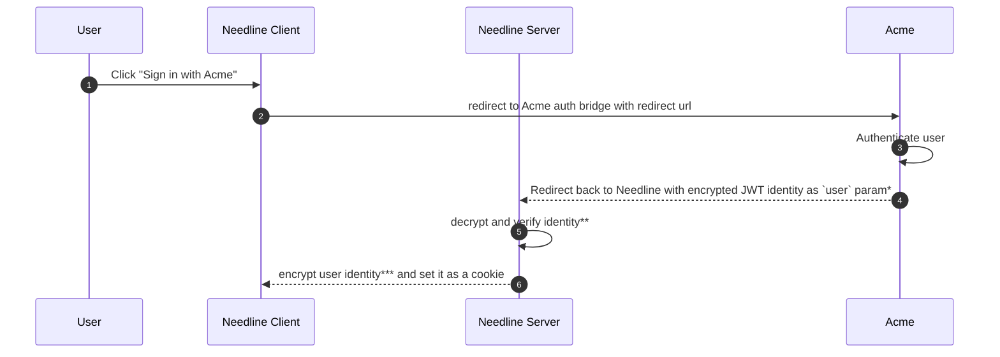

# User Auth

Needline separates public browsing from authenticated customer actions.

Anyone can view public Linear issues or projects that are exposed through the portal. Authentication is only needed when a user wants to submit a customer request or act on behalf of a customer company.

## Flow
`Acme` - your company


`*` - encrypted using private key

`**`- decrypted using public key provided to Needline by Acme

`***` - using Needline private key

> When user sends the request, cookie is decrypted to get the identity.

## What is user Identity?
Extremely minimalistic, just enough to create informative customer requests on linear.

```ts
//src/lib/utils/types.ts
export type User = {
  email: string; 
  name: string;
  company: string; // Acme's customer company (if B2B), otherwise can just be some placeholder
};
```

## How to encrypt? 
```ts
import { constants, privateEncrypt } from "node:crypto";

const encrypt = (user: User, key: string) => {
  return privateEncrypt(
    {
      key: privateKey,
      padding: constants.RSA_PKCS1_PADDING,
    },
    Buffer.from(JSON.stringify(user), "utf8"),
  );
};
```
