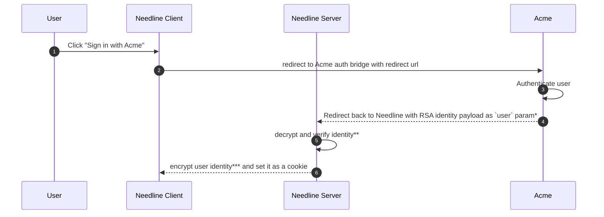

# User Auth

Needline separates public browsing from authenticated customer actions.

Anyone can view public Linear issues or projects that are exposed through the portal. Authentication is only needed when a user wants to submit a customer request or act on behalf of a customer company.

## Flow
`Acme` - your company

```mermaid
 sequenceDiagram
       autonumber

       participant U as User
       participant NC as Needline Client
       participant NS as Needline Server
       participant CB as Acme

       U->>NC: Click "Sign in with Acme"
       NC->>CB: redirect to Acme auth bridge with redirect url


      CB ->>CB: Authenticate user
       CB-->>NS: Redirect back to Needline with RSA identity payload as `user` param*

      NS->>NS: decrypt and verify identity**

      NS-->>NC: encrypt user identity*** and set it as a cookie
```

`*` - encrypted using private key

`**`- decrypted using public key provided to Needline by Acme

`***` - using Needline private key

> When user sends the request, cookie is decrypted to get the identity.

## What is user Identity?
Extremely minimalistic, just enough to create informative customer requests on linear.

```ts
//src/lib/utils/types.ts
export type User = {
  email: string; 
  name: string;
  company: string; // Acme's customer company (if B2B), otherwise can just be some placeholder
};
```

## How to encrypt? 
```ts
import { constants, privateEncrypt } from "node:crypto";

const encrypt = (user: User, key: string) => {
  return privateEncrypt(
    {
      key,
      padding: constants.RSA_PKCS1_PADDING,
    },
    Buffer.from(JSON.stringify(user), "utf8"),
  ).toString("base64url");
};
```

## Redirect from your bridge

Authenticate the customer on your server, construct the `User` from trusted account data, and encode it with the helper above. Validate `callback_url` against your configured Needline callback before redirecting:

```ts
const callback = new URL(callbackUrl);
if (callback.href !== "https://your-needline-domain/callback/company") {
  throw new Error("Invalid callback");
}
callback.searchParams.set("user", encrypt(user, privateKey));
// Redirect the browser to callback.toString().
```

Generate the bridge key pair with `openssl genrsa -out private.pem 2048` and `openssl rsa -in private.pem -pubout -out public.pem`. Keep the private key on your bridge server; copy only the public key into Needline’s `JWT_ENCRYPTION_PUBLIC_KEY`.

This legacy protocol is not a JWT or confidential encryption: anyone with the public key can recover the identity. It has no expiration or replay protection, and RSA limits payload size (245 bytes with a 2048-bit key). See [the deployment review](deployment-review.md) for the recommended replacement.
